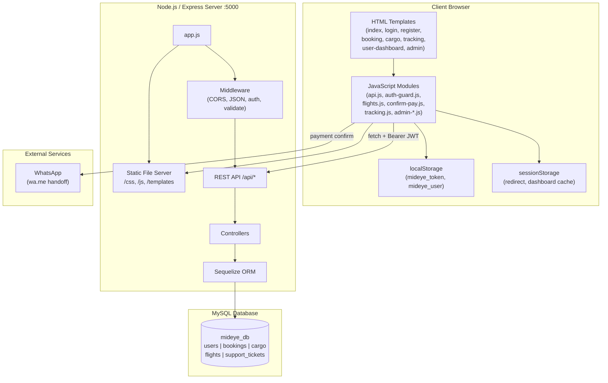
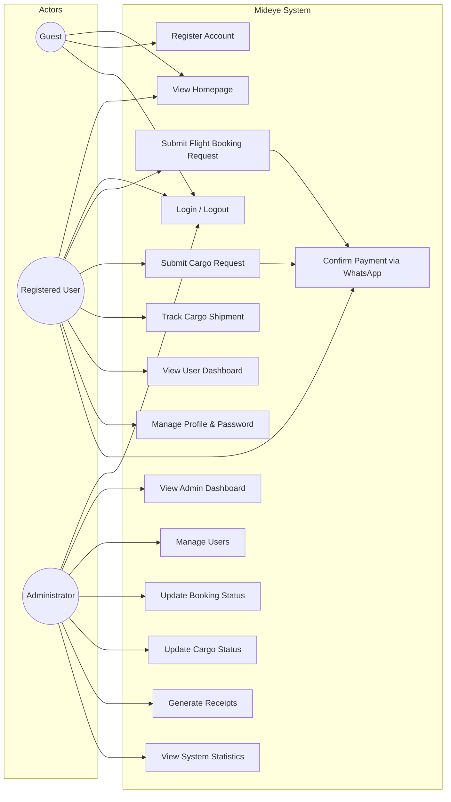
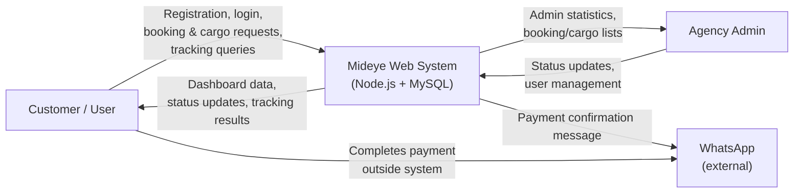
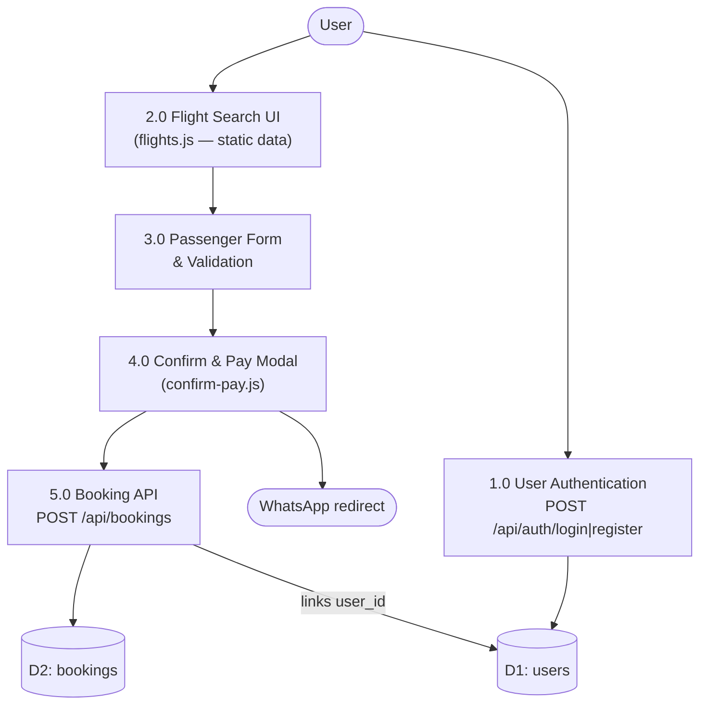
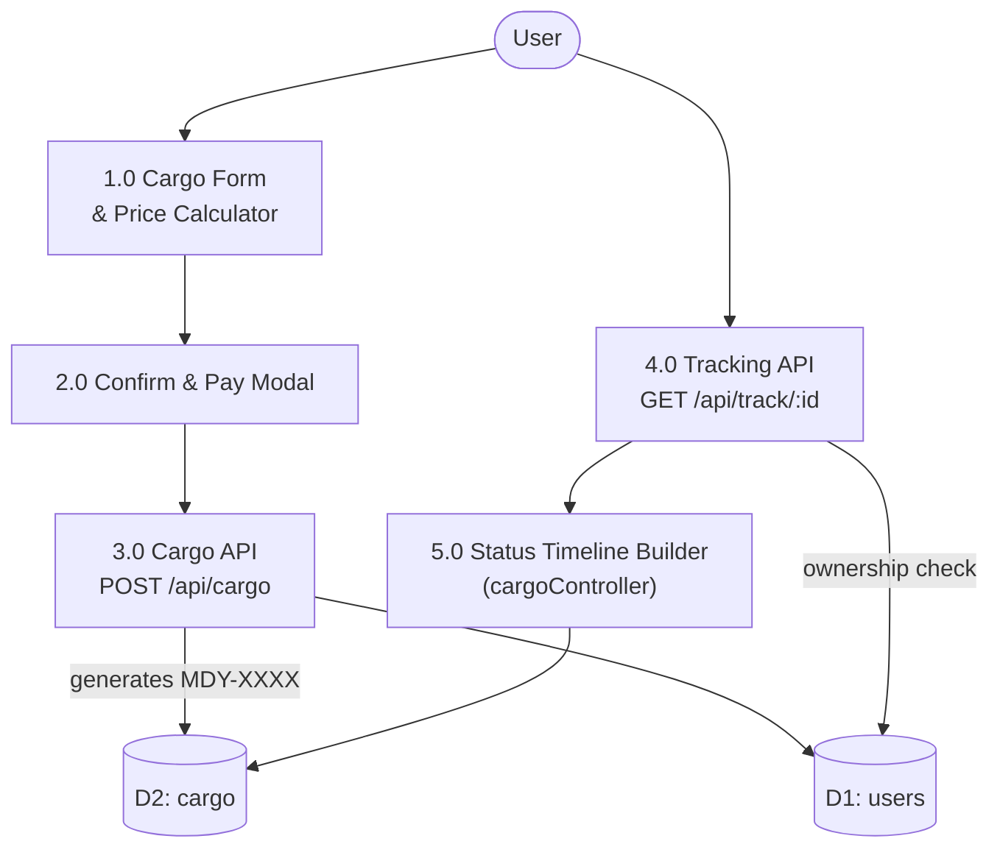
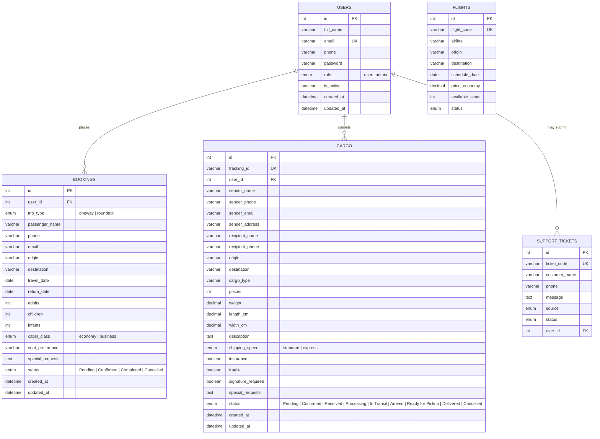
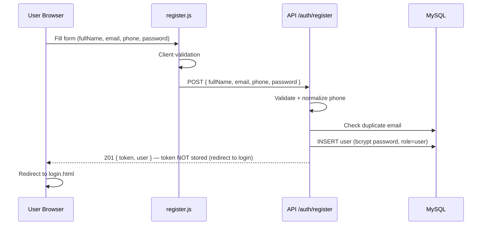
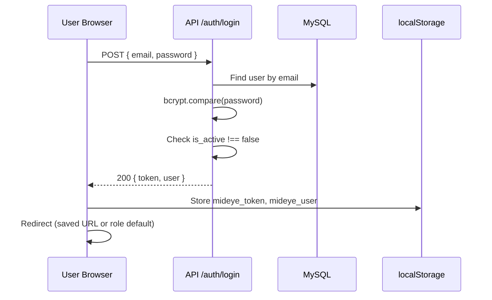
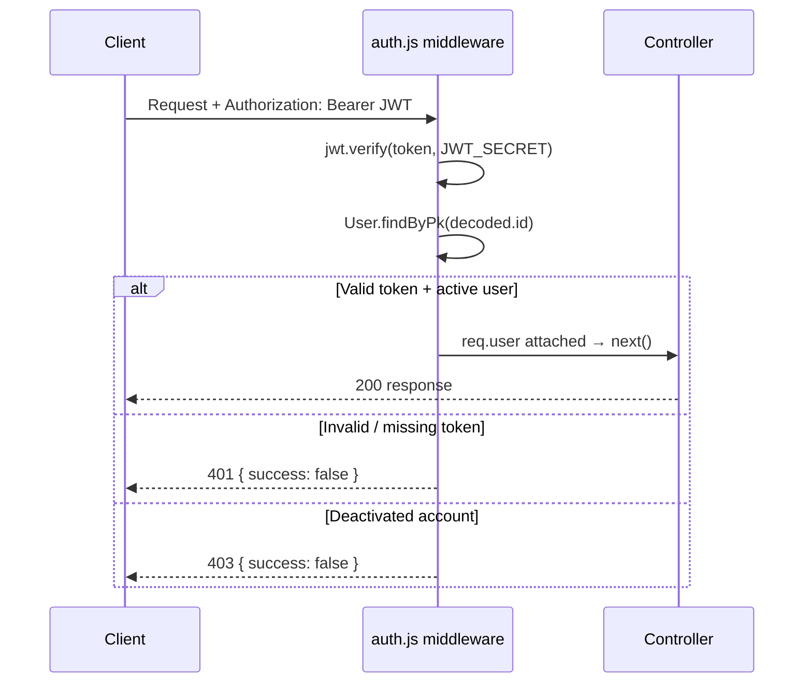

# Mideye Travel Agency — Integrated Flight Booking & Cargo Management System

> **Project documentation and technical report**  
> Based on full codebase analysis (frontend, backend, database, API, and workflows).  
> Last updated: **25 June 2026**

---

# SYSTEM UPDATES & CHANGELOG

> **Summary of all major features and improvements added to Mideye** (June 2026 update).  
> This section documents everything new beyond the original booking + cargo + admin core.

## New Database Tables

| Table | Purpose |
|-------|---------|
| `flights` | Admin-managed flight inventory (airline, route, schedule, pricing, seats, status) |
| `support_tickets` | Customer support / WhatsApp inquiries (`SUP-YYYY-NNNNN` ticket codes) |

## New Backend Modules & API Routes

| Module | Files | Endpoints |
|--------|-------|-----------|
| **Flight inventory** | `models/Flight.js`, `controllers/flightController.js`, `routes/flightRoutes.js`, `utils/flightStatuses.js` | `GET /api/flights` (search), `GET/POST/PUT/DELETE /api/admin/flights` |
| **Support tickets** | `models/SupportTicket.js`, `controllers/supportController.js`, `routes/supportRoutes.js`, `utils/generateSupportTicketCode.js` | `POST /api/support` (public), `GET /api/admin/support`, `PATCH /api/admin/support/:id/status` |
| **Revenue & payments logic** | `utils/revenue.js` | Used by `GET /api/admin/stats` for payment counts and estimated revenue |
| **Cargo workflow** | `utils/cargoStatuses.js` | Extended statuses: `Pending` → `Confirmed` → `Received` → `Processing` → `In Transit` → `Arrived` → `Ready for Pickup` → `Delivered` / `Cancelled` |
| **Booking references** | `utils/formatBookingReference.js` | Formatted booking reference strings for receipts and tickets |
| **User deduplication** | `utils/dedupeUsers.js` | Utility to merge duplicate user records by email/phone |
| **Flight seed data** | `seed-flights.js` | `npm run seed:flights` — populates demo flights (MGQ → HGA) |

## New Admin Dashboard Sections

The admin panel (`frontend/templates/admin.html`) was expanded from 4 sections to **10 sections**:

| Section | Sidebar group | JS module | CSS | Description |
|---------|---------------|-----------|-----|-------------|
| **Dashboard** | Main | inline + stats API | `admin-dashboard.css` | 6 stat cards (Users, Bookings, Cargo, Pending, **Payment**, **Revenue**), overview gauges, activity chart, recent bookings/cargo |
| **Users** | Management | `admin-users.js` | `admin-users.css` | Enhanced table with avatar, bookings total, cargo count, profile modal, edit/delete |
| **Bookings** | Management | inline | `admin-dashboard.css` | Booking list + status updates + receipts |
| **Cargo** | Management | inline + `cargo-status.js` | `cargo-status.css` | Cargo list + extended status pipeline |
| **Flights** | Management | `admin-flights.js` | `admin-flights.css` | Add / edit / delete flights, seat management, status control |
| **Payments** | Finance | `admin-payments.js` | `admin-finance.css` | Invoices, receipts, refunds, payment methods (derived from booking/cargo status) |
| **Reports** | Analytics | `admin-reports.js` | `admin-finance.css` | Flight, cargo, revenue, and customer reports with tabbed views |
| **Notifications** | Communication | `admin-notifications.js` | `admin-ops.css` | WhatsApp message templates (e-ticket, delay, cargo, payment reminder) |
| **Support** | Communication | `admin-support.js` | `admin-ops.css` | Support ticket inbox (API tickets + derived booking/cargo items), WhatsApp reply |
| **Settings** | System | `admin-settings.js` | `admin-ops.css` | Company info, roles/permissions matrix, security session display |

### Admin UI improvements (June 2026)

- **Compact layout** — reduced topbar, stat cards, charts, and table padding so more content fits on screen without zooming
- **Sidebar compaction** — shorter nav items, scrollable nav on small screens
- **Users table scroll** — horizontal scroll on wide tables; `Joined` and `Actions` columns always reachable
- **Topbar** — search, notifications dropdown, messages, settings menu, clock, refresh, logout
- **Clickable stat cards** — Payment and Revenue cards navigate to Payments / Reports sections

## New Customer-Facing Features

| Feature | Files | Description |
|---------|-------|-------------|
| **Database-backed flight search** | `frontend/js/flights.js`, `GET /api/flights` | Booking page loads flights from MySQL; admin manages inventory via Flights section |
| **E-Ticket page** | `frontend/templates/ticket.html`, `frontend/js/user-ticket.js`, `frontend/css/user-ticket-page.css` | Printable / PDF boarding pass for confirmed bookings (`/ticket.html?id=`) |
| **Homepage WhatsApp button** | `frontend/templates/index.html`, `frontend/css/style1.css` | Floating green WhatsApp button (`+252907816567`) |
| **Support contact modal** | `frontend/js/support-contact.js` | Visitor fills name + phone + message → `POST /api/support` → opens WhatsApp with ticket code |
| **Dedicated registration** | `frontend/js/register.js` | Standalone registration validation module |
| **Cargo status UI** | `frontend/js/cargo-status.js`, `frontend/css/cargo-status.css` | Visual status pipeline on cargo and tracking pages |
| **Service pages styling** | `frontend/css/service-pages.css` | Shared styles for booking, cargo, and service pages |

## Latest Enhancements (Requested Updates)

The following requested updates were implemented across backend and frontend:

- **Cities management (Admin):** Added full Cities CRUD under the Flights area in admin (`add/edit/delete/toggle active`) using `backend/models/City.js`, `backend/controllers/cityController.js`, `backend/routes/cityRoutes.js`, and `frontend/js/admin-cities.js`.
- **Active cities on customer pages:** Booking, cargo, and homepage selects now load only active cities from `GET /api/cities` with fallback data to prevent empty dropdowns (`frontend/js/cities.js`).
- **"Loading cities..." fix:** City dropdowns now populate immediately (fallback first, API upgrade second), and booking boot flow explicitly initializes city selects before first search.
- **Staff role support:** User roles now support `user`, `staff`, and `admin` (model + auth + admin UI role selector), with role-based route and section access.
- **Role-based panel visibility:** Staff users can access operational sections (bookings, cargo, flights, cities, support), while admin-only areas remain restricted.
- **Booking passenger categories:** Booking form now supports separate `Adults`, `Children`, and `Infants` flows in UI and pricing summary.
- **Dependent passenger auto-sync:** Increasing `children` or `infants` automatically raises `adults` to match the highest dependent count (up to max 10) in `frontend/js/flights.js`.
- **Cargo service updates:** Added `Medicine / Dawo` cargo type and removed the International section to keep only domestic cargo workflow.
- **Admin dashboard polish:** Improved dashboard presentation and fixed City modal alignment/overlay behavior in admin UI.

## WhatsApp Integration (Office: +252 907 816567)

| Flow | How it works |
|------|----------------|
| **Booking / cargo payment** | `confirm-pay.js` saves request then opens `wa.me/252907816567` with order details |
| **Homepage support** | Modal form creates `support_tickets` row, then opens WhatsApp |
| **Admin notifications** | `admin-notifications.js` builds Somali/English templates and opens WhatsApp per customer |
| **Admin support replies** | `admin-support.js` — Reply via WhatsApp button on each ticket |

> **Note:** Inbound WhatsApp messages are **not** auto-received. Tickets are created when the user submits the web form before WhatsApp opens. Full two-way WhatsApp would require WhatsApp Business API.

## Payment & Revenue (Derived — No Payment Gateway)

Payments are **estimated from booking/cargo status**, not from a real payment processor:

| Type | Counted as **Paid** | Counted as **Pending payment** |
|------|---------------------|-------------------------------|
| Booking | `Confirmed`, `Completed` | `Pending` |
| Cargo | `Arrived`, `Ready for Pickup`, `Delivered` | All other non-cancelled statuses |

Revenue uses `utils/revenue.js` pricing formulas (booking: cabin class × passengers; cargo: weight tiers).

## New npm Scripts

```bash
cd backend
npm run seed:flights        # Seed demo flights (MGQ → HGA)
npm run seed:flights:reset  # Clear and re-seed flights
npm run seed:simple         # Sample users, bookings, cargo
npm run seed:users          # Seed user accounts
```

## Updated File Inventory

```
backend/
├── controllers/
│   ├── adminController.js    # + revenue/payment stats
│   ├── flightController.js   # NEW
│   └── supportController.js  # NEW
├── models/
│   ├── Flight.js             # NEW
│   └── SupportTicket.js      # NEW
├── routes/
│   ├── flightRoutes.js       # NEW
│   └── supportRoutes.js      # NEW
├── utils/
│   ├── revenue.js            # NEW
│   ├── cargoStatuses.js      # NEW
│   ├── flightStatuses.js     # NEW
│   ├── formatBookingReference.js
│   ├── dedupeUsers.js
│   └── generateSupportTicketCode.js  # NEW
└── seed-flights.js           # NEW

frontend/
├── templates/
│   ├── admin.html            # 10 admin sections
│   ├── index.html            # + WhatsApp float + support modal
│   └── ticket.html           # NEW e-ticket page
├── js/
│   ├── admin-flights.js      # NEW
│   ├── admin-payments.js     # NEW
│   ├── admin-reports.js      # NEW
│   ├── admin-notifications.js # NEW
│   ├── admin-support.js      # NEW
│   ├── admin-settings.js     # NEW
│   ├── support-contact.js    # NEW
│   ├── user-ticket.js        # NEW
│   ├── register.js           # NEW
│   └── cargo-status.js       # NEW
└── css/
    ├── admin-finance.css     # NEW
    ├── admin-ops.css         # NEW
    ├── admin-flights.css     # NEW
    ├── cargo-status.css      # NEW
    ├── service-pages.css     # NEW
    └── user-ticket-page.css  # NEW
```

---

# INTRODUCTION

## 1.1 Background of the Study

Travel agencies in Somalia, particularly in regional hubs such as **Galkacyo**, traditionally manage flight bookings and cargo shipments through manual processes: phone calls, in-person visits, paper forms, and informal messaging applications. These methods are prone to data loss, delayed follow-up, inconsistent record-keeping, and limited visibility for both customers and staff.

**Mideye** is a full-stack web application developed to digitize core operations of a local travel agency. The system provides an online interface for customers to register accounts, submit domestic flight booking requests, create cargo shipment requests, and track shipments. Agency administrators manage incoming requests, update statuses, view analytics, and maintain user accounts through a protected admin dashboard.

The implementation follows a **semi-automated** model: the system captures and stores structured requests in a MySQL database, but final confirmation, pricing negotiation, and payment completion occur outside the application—primarily through **WhatsApp** and in-person office visits. This design reflects the operational reality of many local travel agencies rather than attempting to replicate a fully automated global booking platform.

The project is implemented as a **monolithic Node.js application** that serves both REST APIs and static frontend assets from a single Express server (`backend/server.js`, `backend/app.js`), with a multi-page HTML/CSS/JavaScript frontend (`frontend/templates/`).

---

## 1.2 Problem Statement

Local travel agencies face several operational challenges that this project addresses:

1. **Fragmented customer data** — Booking and cargo details are often recorded on paper or scattered across messaging apps, making retrieval and auditing difficult.
2. **No centralized request queue** — Staff lack a single dashboard to view pending flight bookings and cargo shipments.
3. **Limited customer self-service** — Customers cannot easily view their own booking history, cargo history, or shipment status online.
4. **Manual tracking overhead** — Cargo tracking depends on staff manually communicating status updates to senders and recipients.
5. **No role-based access control** — Without a structured authentication system, sensitive operational data cannot be safely exposed online.
6. **Inconsistent validation** — Manual forms accept incomplete or invalid contact information, leading to processing delays.

Mideye was built to provide a structured, web-based management layer that reduces administrative friction while remaining appropriate for agencies that do not integrate with global flight distribution systems (GDS) or automated payment gateways.

---

## 1.3 Objectives of the Study

### General Objective

To design and implement a web-based integrated flight booking and cargo management system that enables customers to submit travel and shipping requests online and allows agency administrators to manage those requests through a secure, role-based dashboard.

### Specific Objectives

1. To implement a secure user registration and authentication system using JWT and bcrypt password hashing.
2. To develop a flight booking request module that captures passenger details, route information, and travel preferences.
3. To develop a cargo shipment request module with auto-generated tracking identifiers (`MDY-XXXX` format).
4. To implement a cargo tracking module that displays shipment status and operational timelines to authenticated users.
5. To build a user dashboard displaying personal booking statistics, booking history, cargo history, and profile management.
6. To build an admin dashboard for managing users, bookings, cargo shipments, and system-wide statistics.
7. To design a relational MySQL database schema with proper entity relationships between users, bookings, and cargo records.
8. To integrate client-side payment confirmation workflow via WhatsApp messaging (not an in-system payment gateway).

---

## 1.4 Research Questions

1. How can a semi-automated web system improve request capture and record-keeping for a local travel agency?
2. What system architecture is appropriate for a small agency that does not require GDS or real-time flight inventory integration?
3. How can role-based access control (user vs. admin) be implemented to protect operational data?
4. What database schema best represents the relationship between customers, flight bookings, and cargo shipments?
5. To what extent can a WhatsApp-based confirmation workflow substitute for integrated online payment processing in this context?
6. What are the limitations of using client-side static flight data versus live airline API integration?

---

## 1.5 Significance of the Study

This project is significant for several stakeholders:

- **Travel agency operators** gain a centralized system to receive, review, and process booking and cargo requests without relying solely on paper or unstructured messaging.
- **Customers** can register accounts, submit requests online, view their activity history, and track cargo shipments linked to their account.
- **Students and developers** can study a complete full-stack implementation using Node.js, Express, Sequelize, JWT authentication, and a multi-page JavaScript frontend.
- **Regional businesses** in Somalia and similar markets can adopt a practical digital solution that respects local payment and communication practices (mobile money coordination via WhatsApp).

The system demonstrates that meaningful digitization does not always require expensive third-party integrations; a well-structured request-management platform can deliver substantial operational value.

---

## 1.6 Scope and Limitations

### Scope (What the system includes)

| Area | Included |
|------|----------|
| User registration with Somali phone validation | Yes |
| JWT-based login and session storage (localStorage) | Yes |
| Flight booking **request** submission | Yes |
| Cargo shipment **request** submission | Yes |
| Auto-generated cargo tracking IDs | Yes |
| Authenticated cargo tracking by tracking ID | Yes |
| User dashboard (stats, bookings, cargo, profile) | Yes |
| Admin dashboard (users, bookings, cargo, stats) | Yes |
| Admin flight inventory management | Yes |
| Admin payment management (invoices, derived from status) | Yes |
| Admin reports & analytics (flights, cargo, revenue, customers) | Yes |
| Admin WhatsApp notifications (templates) | Yes |
| Admin support ticket inbox | Yes |
| Admin settings (company info, roles matrix) | Yes |
| Database-backed flight search on booking page | Yes |
| Public support ticket submission (homepage WhatsApp flow) | Yes |
| E-ticket page (print/PDF for confirmed bookings) | Yes |
| Extended cargo status workflow (9 statuses) | Yes |
| Dashboard payment & revenue statistics | Yes |
| Homepage WhatsApp floating contact button | Yes |
| Admin status updates for bookings and cargo | Yes |
| Admin receipt generation (print/PDF) | Yes |
| WhatsApp payment confirmation handoff | Yes |
| Client-side cargo price estimation | Yes |

### Limitations (What the system does **not** include)

| Area | Status |
|------|--------|
| Live flight search / GDS / airline API integration | **Not implemented** — flights are stored in MySQL and managed by admin; no external airline API |
| Real payment gateway (Stripe, EVC Plus, Zaad, Sahal, etc.) | **Not implemented** — payment method selection is UI-only; revenue is **estimated** from status |
| Email or SMS notifications | **Not implemented** — replaced by **WhatsApp handoff** templates in admin |
| Inbound WhatsApp auto-sync | **Not implemented** — support tickets created via web form before WhatsApp opens |
| Password reset / email verification | **Not implemented** |
| Public (guest) cargo tracking | **Not implemented** — tracking requires authentication (`GET /api/track/:id` uses JWT) |
| Guest booking/cargo submission | **Not implemented** — all create endpoints require JWT (`protect` middleware) |
| Automated tests (unit/integration) | **Not implemented** |
| API documentation (Swagger/OpenAPI) | **Not implemented** |
| Pagination, search, or filtering on API list endpoints | **Not implemented** |
| Token refresh or revocation | **Not implemented** — single JWT with configurable expiry |
| Rate limiting, Helmet, CSRF protection | **Not implemented** |
| Gender field persistence to database | **Not implemented** — collected on booking form UI only; not stored in `bookings` table |
| Production-ready admin API URL | **Partially implemented** — `admin.html` hardcodes `http://localhost:5000/api` instead of using `config.js` |

---

## 1.7 Definition of Key Terms

| Term | Definition |
|------|------------|
| **Booking Request** | A customer-submitted flight travel request stored in the `bookings` table with status `Pending` until admin action. Not a confirmed airline ticket. |
| **Cargo Shipment** | A customer-submitted cargo delivery request stored in the `cargo` table with a unique `tracking_id` (e.g., `MDY-0001`). |
| **Semi-automated System** | A system that digitizes data capture and management but relies on human staff for confirmation, payment, and fulfillment. |
| **JWT (JSON Web Token)** | A signed token issued on login/register, stored client-side in `localStorage`, sent as `Authorization: Bearer <token>` on API requests. |
| **GDS** | Global Distribution System — airline inventory systems. **Not used** in this project. |
| **Sequelize ORM** | Object-Relational Mapping library used to define models and interact with MySQL (`backend/models/`). |
| **Tracking ID** | Unique cargo identifier generated by `backend/utils/generateTrackingId.js` in `MDY-XXXX` format. |
| **Confirm & Pay Modal** | Frontend payment review UI (`frontend/js/confirm-pay.js`) that saves the request via API then redirects to WhatsApp. |
| **Auth Guard** | Client-side route protection module (`frontend/js/auth-guard.js`) that redirects unauthenticated users before page render. |

---

# TOOLS & TECHNOLOGIES USED

## Programming Languages

| Language | Usage |
|----------|-------|
| **JavaScript (ES6+)** | Backend logic, frontend interactivity, API integration |
| **HTML5** | Page structure (`frontend/templates/`) |
| **CSS3** | Styling (`frontend/css/`) |
| **SQL** | Database schema definition (`backend/mideye_schema.sql`, `mideye_db.sql`) |

## Frameworks & Libraries

### Backend (`backend/package.json`)

| Package | Version | Purpose |
|---------|---------|---------|
| **Express.js** | ^4.18.2 | HTTP server and REST API routing |
| **Sequelize** | ^6.37.3 | ORM for MySQL |
| **mysql2** | ^3.9.4 | MySQL database driver |
| **jsonwebtoken** | ^9.0.2 | JWT authentication |
| **bcryptjs** | ^2.4.3 | Password hashing (12 salt rounds) |
| **express-validator** | ^7.0.1 | Request input validation |
| **cors** | ^2.8.5 | Cross-origin resource sharing |
| **dotenv** | ^16.4.5 | Environment variable management |
| **nodemon** | ^3.1.0 | Development auto-reload (devDependency) |

### Frontend (CDN + local)

| Technology | Purpose |
|------------|---------|
| **Bootstrap 5.3.2** | Responsive grid and components |
| **Font Awesome 6.5.0** | Icons |
| **Google Fonts** | Cormorant Garamond + DM Sans typography |
| **AOS 2.3.4** | Scroll animations (homepage only) |
| **html2canvas + jsPDF** | Admin receipt PDF export (`admin.html`) |

## Database Technologies

| Technology | Detail |
|------------|--------|
| **MySQL** | Relational database (`mideye_db`) |
| **InnoDB** | Storage engine with foreign key support |
| **utf8mb4** | Character set for Unicode support |
| **Sequelize sync** | `sync({ alter: false })` on server startup |
| **XAMPP** | Common local development MySQL host (documented in `.env.example`) |

## Development Tools

| Tool | Purpose |
|------|---------|
| **Node.js** | JavaScript runtime for backend |
| **npm** | Package management |
| **Git** | Version control |
| **VS Code / Cursor** | IDE (`.vscode/settings.json` present) |
| **phpMyAdmin / MySQL CLI** | Database administration |
| **Postman / curl** | API testing (no automated test suite) |

## Deployment & Hosting

| File | Configuration |
|------|---------------|
| `backend/render.yaml` | Render.com deployment blueprint (web service, health check `/api/health`) |
| `frontend/vercel.json` | Vercel frontend routing (clean URLs for templates) |
| `backend/.env.example` | Environment variable template |
| `frontend/js/config.js` | API base URL switching (localhost vs production placeholder) |

**Current deployment state:** Production URLs in `config.js` and `app.js` CORS settings use **placeholder values** (`YOUR-RENDER-BACKEND.onrender.com`, `YOUR-VERCEL-DOMAIN.vercel.app`) that must be replaced before live deployment.

---

# SYSTEM DESIGN & IMPLEMENTATION

## 2.1 System Overview

Mideye is a **three-tier web application**:

1. **Presentation Tier** — Multi-page HTML templates with vanilla JavaScript, Bootstrap, and page-specific CSS modules.
2. **Application Tier** — Node.js/Express REST API with controllers, middleware, and validation.
3. **Data Tier** — MySQL database accessed through Sequelize ORM.

The Express server (`backend/app.js`) serves both API routes under `/api/*` and static frontend files from `frontend/`, enabling single-origin local development on port 5000.

### Core functional modules

```
┌─────────────────────────────────────────────────────────────────────────────┐
│                         MIDEYE SYSTEM MODULES (2026)                         │
├──────────────┬──────────────┬──────────────┬──────────────┬──────────────────┤
│ Auth Module  │ Booking Mod. │ Cargo Module │ Tracking Mod.│ Flight Inventory │
├──────────────┼──────────────┼──────────────┼──────────────┼──────────────────┤
│ User Dash.   │ Admin Dash.  │ Confirm&Pay  │ Cargo Pricing│ E-Ticket Page    │
│ (profile)    │ (10 sections)│ (WhatsApp)   │ (client-side)│ (print/PDF)      │
├──────────────┼──────────────┼──────────────┼──────────────┼──────────────────┤
│ Payments*    │ Reports*     │ Notifications*│ Support*    │ Settings*        │
│ (*admin)     │ (*admin)     │ (*WhatsApp)  │ (*tickets)  │ (*admin)         │
└──────────────┴──────────────┴──────────────┴──────────────┴──────────────────┘
```

### User roles

| Role | Access |
|------|--------|
| **Guest (unauthenticated)** | Homepage, login, register; tracking page shell (search requires login) |
| **User (`role: user`)** | Booking, cargo submission, user dashboard, authenticated tracking |
| **Admin (`role: admin`)** | All user capabilities + admin dashboard; redirected away from user dashboard |

---

## 2.2 System Architecture



### Project directory structure

```
Mideye travel agency/
├── backend/
│   ├── server.js              # Entry point, DB connect, admin seed
│   ├── app.js                 # Express app, routes, static files
│   ├── config/database.js     # Sequelize MySQL connection
│   ├── middleware/
│   │   ├── auth.js            # JWT authentication & role guards
│   │   └── validate.js        # express-validator error handler
│   ├── models/
│   │   ├── User.js
│   │   ├── Booking.js
│   │   ├── Cargo.js
│   │   ├── Flight.js
│   │   ├── SupportTicket.js
│   │   └── index.js           # Associations
│   ├── controllers/           # Business logic (7 controllers)
│   ├── routes/                # API route definitions (7 routers)
│   ├── utils/                 # phone, tracking ID, revenue, statuses, refs
│   ├── seed-users.js
│   ├── seed-simple-data.js
│   ├── seed-flights.js
│   └── mideye_schema.sql
├── frontend/
│   ├── templates/             # 10 HTML pages (+ admin sections)
│   ├── js/                    # 24 JavaScript modules
│   └── css/                   # 18 stylesheets
├── mideye_db.sql              # Database dump with sample data
└── README.md
```

---

## 2.3 Use Case Diagram



**Notes from codebase:**
- UC6 requires authentication at submit time (`tracking.js`), though the tracking page HTML is publicly accessible.
- UC9 does not process payments in the backend; it opens WhatsApp with a pre-filled message (`confirm-pay.js`).
- UC4 uses **database-backed flight search** (`GET /api/flights`); admin manages inventory via Flights section.

---

## 2.4 Data Flow Diagram (DFD)

### Context Diagram (Level 0)



### Level 1 DFD — Booking Request Flow



### Level 1 DFD — Cargo Request & Tracking Flow



---

## 2.5 Database Design (ER Diagram)

Derived from `backend/models/`, `backend/mideye_schema.sql`, and Sequelize associations in `backend/models/index.js`.



> **Note:** `flights` and `support_tickets` tables were added in the June 2026 update. See `backend/mideye_schema.sql` for full column definitions.

### Relationship rules

- `bookings.user_id` → `users.id` — **ON DELETE SET NULL** (booking can exist without linked user in schema, but current API always sets `user_id` from JWT)
- `cargo.user_id` → `users.id` — **ON DELETE SET NULL**
- `users.email` — **UNIQUE**
- `cargo.tracking_id` — **UNIQUE**

### Schema drift note

The repository dump `mideye_db.sql` may contain additional columns (`city`, `status`) on the `users` table that are **not defined** in the Sequelize `User` model (`backend/models/User.js`). The authoritative schema for new installations is `backend/mideye_schema.sql`.

---

## 2.6 System Modules

### Module 1: Authentication (`backend/routes/authRoutes.js`, `frontend/js/auth-guard.js`)

| Component | Responsibility |
|-----------|----------------|
| Registration | Creates user with bcrypt-hashed password; validates Somali phone format; issues JWT; redirects to login (does not auto-login) |
| Login | Validates credentials; checks `is_active`; returns JWT + user object |
| Auth Guard (client) | `requireAuth`, `requireUser`, `requireAdmin`, `requireGuest` — page-level protection |
| Token storage | `localStorage`: `mideye_token`, `mideye_user` |

### Module 2: Flight Booking (`frontend/js/flights.js`, `backend/controllers/flightController.js`)

| Step | Description |
|------|-------------|
| 1 | User searches flights via `GET /api/flights?from=&to=&date=` (MySQL `flights` table) |
| 2 | Admin seeds or manages flights via **Flights** section (`npm run seed:flights` for demo data) |
| 3 | User selects a flight card and completes passenger details form (auto-filled from profile) |
| 4 | `openConfirmPayModal()` displays summary and payment method choice |
| 5 | `POST /api/bookings` saves request with `status: Pending` |
| 6 | User redirected to WhatsApp for payment coordination |
| 7 | Confirmed bookings can open **E-Ticket** at `ticket.html?id=<bookingId>` |

**Booking statuses (admin-managed):** `Pending` → `Confirmed` → `Completed` / `Cancelled`

### Module 3: Cargo Management (`frontend/js/api.js`, `backend/controllers/cargoController.js`)

| Step | Description |
|------|-------------|
| 1 | User completes cargo form (sender, recipient, cargo details) |
| 2 | Optional price estimate via `cargo-pricing.js` (client-side tiered calculation) |
| 3 | Confirm & Pay modal → `POST /api/cargo` |
| 4 | Backend generates `tracking_id` via `generateTrackingId.js` |
| 5 | Origin hardcoded to `Galkacyo (GLK)` in controller |

**Cargo statuses (admin-managed):** `Pending` → `Confirmed` → `Received` → `Processing` → `In Transit` → `Arrived` → `Ready for Pickup` → `Delivered` / `Cancelled`

### Module 4: Cargo Tracking (`frontend/js/tracking.js`, `backend/controllers/cargoController.js`)

- Authenticated user submits tracking ID
- `GET /api/track/:tracking_id` returns shipment data + synthesized status timeline
- Users can only view shipments linked to their `user_id` (others receive 404)
- Supports URL parameter auto-search: `tracking.html?id=MDY-0001`

### Module 5: User Dashboard (`frontend/templates/user-dashboard.html`)

| Section | API Endpoint |
|---------|-------------|
| Statistics cards | `GET /api/user/stats` |
| My Bookings table | `GET /api/user/bookings` |
| My Cargo table | `GET /api/user/cargo` |
| Profile settings | `GET/PUT /api/user/profile` |
| Change password | `PUT /api/user/change-password` |

Uses `sessionStorage` cache (`mideye_dash_{userId}`) for instant render, then background API refresh.

### Module 6: Admin Dashboard (`frontend/templates/admin.html`, `admin-users.js`, `admin-receipts.js`, `admin-flights.js`, `admin-payments.js`, `admin-reports.js`, `admin-notifications.js`, `admin-support.js`, `admin-settings.js`)

| Feature | API / Implementation |
|---------|---------------------|
| Dashboard statistics (users, bookings, cargo, pending, payments, revenue) | `GET /api/admin/stats` |
| Overview gauges & activity chart | Client-side from stats + booking/cargo data |
| User management (view, profile modal, edit, role, activate/deactivate, delete) | `GET/PUT/PATCH/DELETE /api/admin/users` |
| Booking management (view, status update, receipts) | `GET /api/admin/bookings`, `PUT /api/bookings/:id` |
| Cargo management (view, extended status update) | `GET /api/admin/cargo`, `PUT /api/cargo/:id` |
| Flight inventory (CRUD) | `GET/POST/PUT/DELETE /api/admin/flights` |
| Payment management (invoices, receipts, methods) | Derived client-side from bookings/cargo (`admin-payments.js`) |
| Reports & analytics (flights, cargo, revenue, customers) | Client-side (`admin-reports.js`) |
| WhatsApp notifications (templates) | Client-side (`admin-notifications.js`) → `wa.me` |
| Support ticket inbox | `GET /api/admin/support`, `PATCH /api/admin/support/:id/status` |
| Settings (company info, roles matrix) | `localStorage` (`admin-settings.js`) |
| Receipt / PDF generation | Client-side HTML + print/PDF (`admin-receipts.js`) |

Admin guards prevent: deleting admins, deactivating admins, changing own role, demoting last admin.

### Module 7: Confirm & Pay / WhatsApp (`frontend/js/confirm-pay.js`)

Shared modal used by booking and cargo pages:

1. Display order summary and amount
2. User selects payment method (`mobile_money` or `cash_office`) — **UI only, not sent to API**
3. Execute `submitFn()` to persist booking/cargo
4. Build WhatsApp message and redirect to `https://wa.me/252907816567`

### Module 8: Registration Validation (`frontend/js/register.js`, `backend/utils/phone.js`)

- Client-side: full name, email, Somali phone, password strength, disposable email block
- Server-side: `express-validator` + Somali phone normalization (`+252XXXXXXXXX`)

### Module 9: Flight Inventory (`backend/models/Flight.js`, `frontend/js/admin-flights.js`)

- Admin creates/edits/deletes scheduled flights with pricing (economy/business/first), seats, and status
- Customer booking page queries `GET /api/flights` by origin, destination, and date
- Demo data: `npm run seed:flights` (7 airlines, MGQ → HGA)

### Module 10: Payment Management (`frontend/js/admin-payments.js`, `backend/utils/revenue.js`)

- Invoices and receipts **derived** from booking/cargo records and status
- Payment methods displayed: EVC Plus, Hormuud Pay, Zaad, Sahal, Cash, Bank Transfer (UI labels only)
- Dashboard stats: `totalPayments`, `pendingPayments`, `totalRevenue`

### Module 11: Reports & Analytics (`frontend/js/admin-reports.js`)

- Tabbed reports: Flights, Cargo, Revenue (6-month chart), Customers
- Aggregates from loaded admin data (no separate report API)

### Module 12: WhatsApp Notifications (`frontend/js/admin-notifications.js`)

- Templates: E-Ticket Ready, Flight Delay, Cargo Update, Payment Reminder (Somali/English)
- Auto-fills customer context from bookings/cargo; opens WhatsApp per recipient
- Send log stored in `localStorage`

### Module 13: Support Tickets (`frontend/js/support-contact.js`, `frontend/js/admin-support.js`)

- **Public:** Homepage modal → `POST /api/support` → ticket code `SUP-YYYY-NNNNN` → WhatsApp
- **Admin:** Lists API tickets merged with open booking/cargo items; status updates; WhatsApp reply

### Module 14: E-Ticket (`frontend/templates/ticket.html`, `frontend/js/user-ticket.js`)

- Authenticated users view/print/PDF boarding pass for **Confirmed** or **Completed** bookings
- Route: `/ticket.html?id=<bookingId>`

### Module 15: Homepage WhatsApp Contact (`frontend/templates/index.html`, `frontend/css/style1.css`)

- Floating WhatsApp button (bottom-right) linked to office number `+252907816567`
- Opens support contact modal before WhatsApp handoff

---

## 2.7 System Implementation

### Backend implementation pattern

```
Request → Route → Middleware (auth, validate) → Controller → Sequelize Model → MySQL
```

- **Entry:** `server.js` connects to database, syncs models, seeds default admin, starts HTTP listener.
- **Routing:** Seven routers mounted in `app.js` at `/api/auth`, `/api/user`, `/api/bookings`, `/api/cargo`, `/api/flights`, `/api/admin`, `/api/support`.
- **Error responses:** Consistent JSON format `{ success: false, message, errors? }`.
- **Success responses:** `{ success: true, data, message? }`.

### Frontend implementation pattern

- **Multi-page application (MPA)** — no SPA framework; each template loads its own script bundle.
- **API integration** — `fetch()` with JSON body and Bearer token (`frontend/js/api.js` pattern).
- **Route guards** — inline `<script>AuthGuard.requireX()</script>` in `<head>` before body renders.
- **Design system** — brown/gold/cream palette; Bootstrap 5 grid; page-specific CSS modules.

### Key implementation files

| Workflow | Primary Files |
|----------|---------------|
| Server startup | `backend/server.js`, `backend/config/database.js` |
| API routing | `backend/app.js`, `backend/routes/*.js` |
| Auth | `backend/middleware/auth.js`, `backend/controllers/authController.js` |
| Booking | `frontend/js/flights.js`, `backend/controllers/bookingController.js` |
| Cargo | `frontend/js/api.js`, `backend/controllers/cargoController.js` |
| Tracking | `frontend/js/tracking.js`, `backend/controllers/cargoController.js` |
| User dashboard | `frontend/templates/user-dashboard.html` (inline JS) |
| Admin dashboard | `frontend/templates/admin.html`, `admin-users.js`, `admin-receipts.js` |

---

## 2.8 Authentication & Authorization Flow

### Registration flow



### Login flow



### API request authorization



### Role-based page access (client-side)

| Page | Guard | Redirect on failure |
|------|-------|---------------------|
| `booking.html`, `cargo.html` | `requireAuth()` | `login.html` |
| `user-dashboard.html` | `requireUser()` | `login.html` or `admin.html` (if admin) |
| `admin.html` | `requireAdmin()` | `login.html` or `user-dashboard.html` |
| `login.html`, `register.html` | `requireGuest()` | `index.html` or `admin.html` |

### Admin API authorization

All `/api/admin/*` routes use `router.use(authenticateToken)` + `adminOnly` middleware (`role === 'admin'`).

---

## 2.9 Screenshots / Modules Explanation

> Placeholder sections for project submission screenshots. Replace `<!-- SCREENSHOT: ... -->` markers with actual images.

### 9.1 Public Homepage
<!-- SCREENSHOT: Homepage hero section, services, and navigation -->
- Marketing landing page (`index.html`)
- Links to booking, cargo, tracking, login, register

### 9.2 User Registration & Login
<!-- SCREENSHOT: Registration form with validation -->
<!-- SCREENSHOT: Login form with toast notifications -->
- Registration with Somali phone validation
- Login with redirect-after-login support

### 9.3 Flight Booking Module
<!-- SCREENSHOT: Booking page — flight search sidebar -->
<!-- SCREENSHOT: Available flights grid -->
<!-- SCREENSHOT: Passenger details form -->
- Static flight search and selection
- Passenger form with profile auto-fill
- Confirm & Pay modal

### 9.4 Cargo Request Module
<!-- SCREENSHOT: Cargo form — sender/recipient sections -->
<!-- SCREENSHOT: Price calculator and shipping speed -->
- Full cargo request form
- Client-side price estimation

### 9.5 Cargo Tracking Module
<!-- SCREENSHOT: Tracking search form -->
<!-- SCREENSHOT: Tracking results — pipeline and details -->
- Authenticated tracking by `MDY-XXXX` ID
- Status pipeline and operational timeline

### 9.6 User Dashboard
<!-- SCREENSHOT: Dashboard statistics cards -->
<!-- SCREENSHOT: My Bookings and My Cargo tables -->
<!-- SCREENSHOT: Profile settings -->
- Personal stats, booking/cargo history, profile management

### 9.7 Admin Dashboard
<!-- SCREENSHOT: Admin statistics overview -->
<!-- SCREENSHOT: Users management table -->
<!-- SCREENSHOT: Booking/cargo status update modal -->
<!-- SCREENSHOT: Receipt print/PDF -->
- Full operational management interface
- User CRUD, status updates, receipts

### 9.8 WhatsApp Payment Handoff
<!-- SCREENSHOT: Confirm & Pay modal -->
<!-- SCREENSHOT: WhatsApp message with booking details -->
- Payment method selection (UI only)
- External payment completion via WhatsApp

---

# RESULTS & DISCUSSION

## 3.1 System Testing Results

Testing was performed through **manual functional verification** during development. No automated test suite exists in the repository.

| Module | Test Scenario | Expected Result | Observed Result |
|--------|---------------|-----------------|-----------------|
| Registration | Valid user with Somali phone | Account created, redirect to login | Pass |
| Registration | Duplicate email | 409 error returned | Pass |
| Login | Valid credentials | JWT issued, redirect by role | Pass |
| Login | Deactivated account | 403 forbidden | Pass |
| Booking | Authenticated user submits form | Booking saved as `Pending` with `user_id` | Pass |
| Booking | Unauthenticated submit | Redirect to login | Pass |
| Cargo | Authenticated submission | Cargo saved with `MDY-XXXX` tracking ID | Pass |
| Tracking | Own shipment ID | Full tracking UI rendered | Pass |
| Tracking | Another user's shipment ID | 404 not found | Pass |
| User dashboard | After booking/cargo | Counts and tables update via API | Pass |
| Admin | Status update | Booking/cargo status changes in DB | Pass |
| Admin | Delete non-admin user | User removed; bookings/cargo `user_id` set null | Pass |
| Confirm & Pay | Submit flow | API save + WhatsApp redirect | Pass |

**Known issues identified during analysis (not test failures):**
- `admin.html` hardcodes API URL to localhost — breaks in production without manual edit
- Flight search does not reflect actual airline availability
- Payment method selection is not persisted

---

## 3.2 Performance Evaluation

| Aspect | Assessment |
|--------|------------|
| **Database queries** | Simple `findAll` / `count` without pagination — adequate for small agency data volumes; may degrade with thousands of records |
| **API response size** | Full table dumps on list endpoints — no pagination increases payload size linearly |
| **Frontend loading** | Multi-page architecture with CDN Bootstrap/Font Awesome — reasonable load times; no bundler/minification pipeline |
| **Dashboard caching** | User dashboard uses `sessionStorage` cache — improves perceived performance on repeat visits |
| **Static flight data** | Instant search results (no network call) — fast but not representative of real inventory |
| **JWT validation** | Database lookup on every authenticated request (`User.findByPk`) — acceptable at small scale |
| **Concurrent users** | Single Node.js process, no clustering configured — suitable for development and low-traffic deployment |

---

## 3.3 Analysis of Results

The system **achieves its primary objectives** as a semi-automated travel agency management platform:

**Achieved:**
- Digitized booking and cargo request capture with structured database storage
- Role-based access separating customer and admin operations
- User self-service dashboard for viewing personal activity
- Admin operational dashboard with status management and reporting
- Cargo tracking with unique identifiers and visual status pipelines
- Secure authentication with industry-standard password hashing and JWT

**Partially achieved:**
- Payment processing (WhatsApp handoff only, not in-system)
- Flight booking (request form only, not live booking engine)
- Production deployment readiness (placeholder URLs, admin API hardcoding)

**Not achieved (by design or omission):**
- Automated email/SMS notifications
- Real-time flight inventory
- Integrated mobile money payment APIs

The semi-automated model is **appropriate for the target domain** (Galkacyo local travel agency) where personal communication and manual confirmation remain standard practice.

---

## 3.4 Comparison with Existing Systems

| Feature | Manual / Paper Process | Generic Booking Sites (e.g., Skyscanner) | **Mideye (This System)** |
|---------|------------------------|------------------------------------------|---------------------------|
| Request capture | Paper, phone, WhatsApp | Automated ticket purchase | Online structured forms |
| Payment | Cash, mobile money in person | Online card/gateway | WhatsApp handoff + office cash |
| Flight inventory | Phone inquiry to airlines | Live GDS/API data | Static demo data (request only) |
| Cargo tracking | Phone follow-up | N/A or carrier portals | Web tracking with status pipeline |
| Customer history | None centralized | Account-based | User dashboard with API data |
| Admin management | Spreadsheets/paper | Platform-managed | Dedicated admin dashboard |
| Cost/complexity | Low | High (API fees, integrations) | Low–medium (self-hosted Node.js) |
| Local relevance | High | Low (not Somalia-focused) | High (Somali phone, Galkacyo origin, WhatsApp) |

Mideye occupies a **practical middle ground**: more structured than manual operations, but more affordable and locally appropriate than enterprise travel platforms.

---

# CONCLUSION & FUTURE IMPROVEMENTS

## Conclusion

Mideye is a functional full-stack web application that successfully digitizes the core workflows of a local travel agency in Galkacyo, Somalia. The system implements secure user authentication, structured flight booking requests, cargo shipment management with auto-generated tracking identifiers, authenticated cargo tracking, and comprehensive user and admin dashboards.

Built with **Node.js, Express, Sequelize, MySQL, and vanilla JavaScript**, the project demonstrates a complete three-tier architecture with **35+ REST API endpoints**, **five relational database entities** (`users`, `bookings`, `cargo`, `flights`, `support_tickets`), and **ten frontend pages** with an **expanded admin panel (10 sections)**. The semi-automated design—combining online request capture with WhatsApp-based payment coordination and manual admin processing—reflects realistic operational constraints rather than attempting unsupported full automation.

The codebase analysis confirms that all documented features are grounded in actual implementation, with clearly identified limitations (no payment gateway, no live flight API, no email notifications) that define the system's current boundaries.

---

## Future Enhancements

| Priority | Enhancement | Rationale |
|----------|-------------|-----------|
| **High** | Integrate real payment APIs (EVC Plus, Zaad, Sahal) | Replace WhatsApp-only payment handoff |
| **High** | Fix production configuration (`config.js`, `admin.html` API URL) | Enable reliable deployment |
| **High** | Add automated tests (Jest/Mocha + Supertest) | Improve reliability and maintainability |
| **Medium** | Email/SMS notifications on status changes | Reduce manual customer communication |
| **Medium** | Password reset flow | Improve account recovery |
| **Medium** | API pagination and search filters | Scale admin/user list endpoints |
| **Medium** | Persist gender and payment method in database | Complete data capture from booking form |
| **Medium** | Public guest tracking (optional auth) | Improve tracking accessibility |
| **Low** | Live flight API or airline partnership integration | Replace static `FLIGHTS_DATA` |
| **Low** | Swagger/OpenAPI documentation | Improve API discoverability |
| **Low** | Rate limiting and Helmet security middleware | Harden production security |
| **Low** | Token refresh mechanism | Improve session management |
| **Low** | Migrate frontend to a component framework (React/Vue) | Improve maintainability at scale |

---

## Quick Start (Developer Reference)

```bash
# 1. Database
# Import backend/mideye_schema.sql into MySQL (XAMPP)

# 2. Backend
cd backend
cp .env.example .env    # Configure DB credentials and JWT_SECRET
npm install
npm start               # http://localhost:5000

# 3. Optional seed data
npm run seed:flights    # Demo flights for booking search (MGQ → HGA)
npm run seed:simple     # Sample users, bookings, cargo

# 4. Access
# Homepage:    http://localhost:5000/
# Login:       http://localhost:5000/login.html
# Booking:     http://localhost:5000/booking.html
# Ticket:      http://localhost:5000/ticket.html
# Admin:       http://localhost:5000/admin.html

# Default admin (auto-seeded on startup):
# Email:    admin@mideye.com
# Password: Admin@123

# Office WhatsApp: +252 907 816567
```

### Environment variables (`backend/.env.example`)

| Variable | Description |
|----------|-------------|
| `PORT` | Server port (default: 5000) |
| `DB_HOST`, `DB_PORT`, `DB_NAME`, `DB_USER`, `DB_PASSWORD` | MySQL connection |
| `JWT_SECRET` | Token signing secret |
| `JWT_EXPIRES_IN` | Token expiry (default: 7d) |

---

## API Endpoint Summary

| Method | Endpoint | Auth | Description |
|--------|----------|------|-------------|
| POST | `/api/auth/register` | Public | Register user |
| POST | `/api/auth/login` | Public | Login |
| GET | `/api/auth/me` | JWT | Current user |
| GET | `/api/user/profile` | JWT | User profile |
| PUT | `/api/user/profile` | JWT | Update profile |
| PUT | `/api/user/change-password` | JWT | Change password |
| GET | `/api/user/stats` | JWT | Dashboard stats |
| GET | `/api/user/bookings` | JWT | User bookings |
| GET | `/api/user/cargo` | JWT | User cargo |
| POST | `/api/bookings` | JWT | Create booking |
| GET | `/api/bookings` | JWT | List bookings |
| GET | `/api/bookings/:id` | JWT | Get booking |
| PUT | `/api/bookings/:id` | Admin | Update status |
| POST | `/api/cargo` | JWT | Create cargo |
| GET | `/api/cargo` | JWT | List cargo |
| GET | `/api/cargo/:id` | JWT | Get cargo |
| PUT | `/api/cargo/:id` | Admin | Update status |
| GET | `/api/track/:tracking_id` | JWT | Track cargo |
| GET | `/api/flights` | JWT | Search flights (`?from=&to=&date=`) |
| POST | `/api/support` | Public | Create support ticket (homepage WhatsApp flow) |
| GET | `/api/admin/stats` | Admin | Dashboard stats (incl. payments & revenue) |
| GET | `/api/admin/users` | Admin | All users |
| PUT | `/api/admin/users/:id` | Admin | Update user |
| PATCH | `/api/admin/users/:id/role` | Admin | Change role |
| PATCH | `/api/admin/users/:id/status` | Admin | Activate/deactivate |
| DELETE | `/api/admin/users/:id` | Admin | Delete user |
| GET | `/api/admin/bookings` | Admin | All bookings |
| GET | `/api/admin/cargo` | Admin | All cargo |
| GET | `/api/admin/flights` | Admin | All flights |
| POST | `/api/admin/flights` | Admin | Create flight |
| PUT | `/api/admin/flights/:id` | Admin | Update flight |
| DELETE | `/api/admin/flights/:id` | Admin | Delete flight |
| GET | `/api/admin/support` | Admin | All support tickets |
| PATCH | `/api/admin/support/:id/status` | Admin | Update ticket status |
| GET | `/api/health` | Public | Health check |

---

## License & Attribution

This project was developed as an academic and practical software engineering exercise for **Mideye Travel Agency, Galkacyo, Somalia**.

---

*This document was generated from comprehensive codebase analysis of all frontend templates, JavaScript modules, backend routes, controllers, models, middleware, database schema, and deployment configuration files. See **SYSTEM UPDATES & CHANGELOG** at the top for the full June 2026 feature list. Features not present in the code are explicitly marked as not implemented.*
# mideye-system
